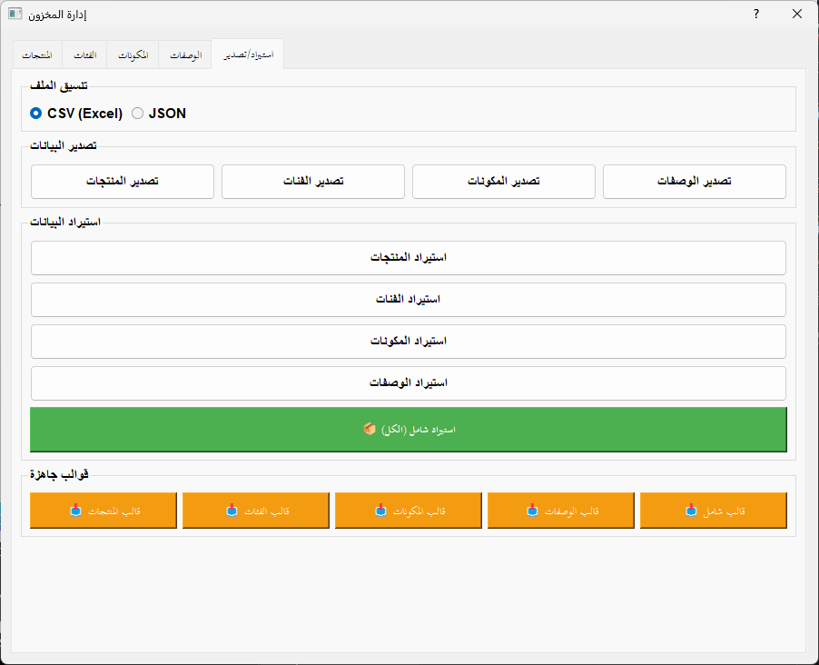

# نظام نقاط البيع للمطاعم (Restaurant POS System)

نظام نقاط بيع متكامل مصمم خصيصًا للمطاعم، يوفر واجهة مستخدم سهلة الاستخدام ويدعم اللغتين العربية والإنجليزية. يتميز النظام بمجموعة واسعة من الوظائف التي تلبي احتياجات التشغيل اليومي للمطاعم، بدءًا من إدارة المبيعات وحتى التقارير المتقدمة.

## الميزات الرئيسية

### للمستخدمين العاديين

#### **تجربة مستخدم سلسة**

*   **واجهة تفاعلية باللمس**: تصميم يركز على اللمس لتجربة استخدام سريعة وفعالة.
*   **إدارة ورديات متكاملة**: نظام شامل لإدارة الورديات والخزينة، مما يضمن دقة العمليات المالية.
*   **نظام فواتير شامل**: يدعم إصدار الفواتير مع احتساب الضريبة (ZATCA) وطباعة حرارية سريعة.
*   **مرتجعات مرنة**: آلية سهلة وفعالة لإدارة مرتجعات المنتجات.
*   **تقارير شاملة**: مجموعة من التقارير الأساسية لمتابعة أداء المطعم، تشمل:
    *   تقرير المبيعات اليومية والشهرية.
    *   تقرير المخزون والمنتجات منخفضة المخزون.
    *   تقرير الورديات والحركات النقدية.
    *   تقرير المرتجعات.
    *   تقرير الربحية.

#### **ميزات متقدمة (الإصدار 3.0)**

*   **تكامل تام مع تيليجرام 🤖**: استقبل أكثر من 15 نوعًا من التقارير التلقائية (مثل فتح/إغلاق الوردية، المبيعات، تنبيهات المخزون) مباشرة على هاتفك، لتبقى على اطلاع دائم بأداء مطعمك.
*   **إدارة ذكية بالقوالب (AI-Ready) 🧠**: استورد وصدر القوائم (المنيو)، المكونات، والوصفات كملفات CSV جاهزة. يتيح لك هذا الاستفادة من نماذج الذكاء الاصطناعي لتوليد وتعديل القوائم والوصفات بسهولة وسرعة فائقة، ثم رفعها إلى النظام بضغطة زر.
*   **نظام المكونات والوصفات**: إدارة دقيقة للمكونات وربطها بالمنتجات لحساب التكلفة بدقة.
*   **دعم ZATCA QR Code**: توافق كامل مع متطلبات الفاتورة الإلكترونية السعودية.
*   **نسخ احتياطي تلقائي**: حماية بياناتك بنسخ احتياطي تلقائي وآمن.
*   **طباعة تذكرة المطبخ**: تنظيم فعال لطلبات المطبخ لضمان سير العمل بسلاسة.

#### **معرض الصور**


*تكامل النظام مع تيليجرام لإرسال التقارير التلقائية.*


*واجهة تصدير واستيراد القوالب لدعم الإدارة الذكية.*

## التثبيت والاستخدام (للمستخدم العادي)

للبدء في استخدام النظام بسرعة وسهولة، اتبع الخطوات التالية:

1.  **تحميل برنامج التثبيت**: اذهب إلى قسم [الإصدارات (Releases)](../../releases) في هذا المستودع.
2.  **تنزيل أحدث إصدار**: قم بتحميل ملف التثبيت `RestaurantPOS_Setup.exe`.
3.  **التثبيت**: قم بتشغيل الملف واتبع التعليمات البسيطة. يدعم برنامج التثبيت اللغتين العربية والإنجليزية.
4.  **التشغيل**: بعد اكتمال التثبيت، ستجد اختصار النظام على سطح المكتب. قم بتشغيله وابدأ في إدارة مطعمك فورًا.

> **ملاحظة هامة**: يعمل البرنامج بشكل محلي بالكامل ولا يتطلب صلاحيات مسؤول. يقوم بإنشاء قاعدة بياناته الخاصة بشكل آمن في مجلد التطبيقات الخاص بالمستخدم.

### **الاستخدام الأول**

للبدء بعد التثبيت، اتبع هذه الخطوات:

1.  **تسجيل الدخول الافتراضي**:
    *   اسم المستخدم: `admin`
    *   كلمة المرور: `admin123`
2.  **فتح وردية جديدة**:
    *   انتقل إلى قسم "الورديات".
    *   اضغط على "فتح وردية جديدة".
    *   أدخل المبلغ الافتتاحي.
3.  **البدء في البيع**:
    *   انتقل إلى "نقطة البيع".
    *   اختر المنتجات المطلوبة.
    *   اضغط على "إتمام الدفع".

## للمطورين والمساهمين

هذا القسم مخصص للمطورين الذين يرغبون في التعديل على النظام أو المساهمة في تطويره.

### **تشغيل من الكود المصدري**

لتشغيل النظام من الكود المصدري، تأكد من توفر المتطلبات التالية:

*   `PyQt5==5.15.10`
*   `qrcode==7.4.2`
*   `openpyxl==3.1.2`
*   `requests==2.31.0`
*   `loguru==0.7.2`
*   `Pillow==10.0.1`

**خطوات التشغيل**:

```bash
# استنساخ المستودع
git clone https://github.com/SMSMy/POS.git
cd POS

# تثبيت المتطلبات
pip install -r requirements.txt

# تشغيل التطبيق
python main.py
```

### **هيكل قاعدة البيانات**

يستخدم النظام قاعدة بيانات SQLite يتم إنشاؤها تلقائيًا عند التشغيل الأول. تتضمن الجداول الرئيسية ما يلي:

| الجدول           | الوصف                               |
| :--------------- | :---------------------------------- |
| `users`          | معلومات المستخدمين وأدوارهم         |
| `categories`     | فئات المنتجات                       |
| `products`       | تفاصيل المنتجات                     |
| `ingredients`    | المكونات المستخدمة في الوصفات       |
| `recipes`        | وصفات تحضير المنتجات                |
| `shifts`         | سجلات الورديات                      |
| `invoices`       | الفواتير الصادرة                    |
| `invoice_items`  | تفاصيل عناصر كل فاتورة              |
| `payments`       | سجلات الدفع                         |
| `cash_movements` | حركات النقدية في الخزينة            |
| `returns`        | سجلات مرتجعات المنتجات              |
| `settings`       | إعدادات النظام العامة               |

### **الترجمة**

يدعم النظام اللغتين العربية والإنجليزية. يمكن تحديد اللغة المفضلة من خلال إعدادات النظام.

### **إعدادات تيليجرام**

لتفعيل إرسال التقارير عبر تيليجرام، اتبع الخطوات التالية:

1.  أنشئ بوتًا جديدًا عبر `@BotFather` على تيليجرام.
2.  احصل على `Bot Token` الخاص بالبوت.
3.  أضف البوت إلى مجموعتك على تيليجرام.
4.  احصل على `Chat ID` للمجموعة.
5.  أدخل هذه البيانات في إعدادات النظام.

### **الفاتورة الإلكترونية (ZATCA)**

يتم توليد رمز الاستجابة السريعة (QR Code) تلقائيًا للفواتير وفقًا لمعايير هيئة الزكاة والضريبة والجمارك السعودية (ZATCA)، متضمنًا البيانات الأساسية:

*   اسم البائع.
*   الرقم الضريبي.
*   التاريخ والوقت.
*   الإجمالي شامل الضريبة.
*   مبلغ الضريبة.

### **النسخ الاحتياطي**

يتم إنشاء نسخ احتياطية تلقائية يوميًا لضمان أمان البيانات. يمكن استعادة هذه النسخ من واجهة الإعدادات.

### **أدوات التطوير**

للمطورين، يمكن استخدام الأدوات التالية لتحسين جودة الكود:

```bash
# تثبيت أدوات التطوير
pip install -e ".[dev]"

# تشغيل الاختبارات
pytest

# تنسيق الكود تلقائيًا
black src/

# فحص الأخطاء البرمجية
flake8 src/
```

### **الترخيص**

هذا المشروع مفتوح المصدر بالكامل (100% Open Source) ومرخص تحت [رخصة MIT](LICENSE). يمكن للجميع استخدامه، التعديل عليه، وتوزيعه بحرية.

### **المساهمة**

نرحب بمساهماتكم في تطوير هذا المشروع. يرجى قراءة [دليل المساهمة](CONTRIBUTING.md) قبل إرسال طلبات السحب (Pull Requests).

### **الدعم**

للحصول على الدعم الفني أو الإبلاغ عن المشاكل، يرجى التواصل عبر:


*   صفحة المشاكل (GitHub Issues) على المستودع.

### **شكر خاص**

نتوجه بالشكر الجزيل لكل من ساهم في تطوير وتحسين هذا المشروع.

---

**Restaurant POS System v3.0** - نظام نقاط بيع متكامل للمطاعم
💻 **مفتوح المصدر بالكامل - Open Source**
